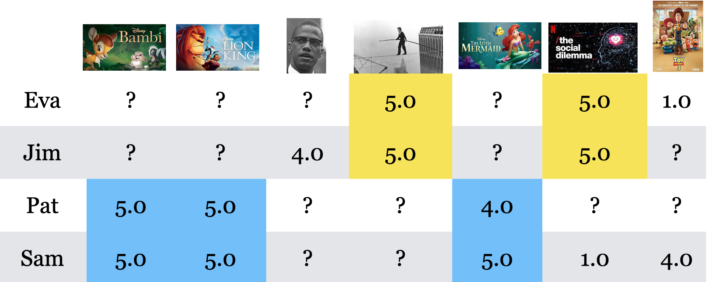

## Focus on the breath!

{.nostretch fig-align="center" width="500px"}

## Quick warm-up {background-color="#fafabc"}

Pair up with someone nearby.

**Question:** Where have you seen AI in real life?

Examples could include:

- phone cameras
- recommendations
- autocomplete
- ...

## What are we doing today? {.smaller}

We are going to open up the black box a little. By the end, you should be able to explain:

- what people mean by **AI**, **machine learning**, and **deep learning**
- why predicting the next word can be powerful

> I'm attending this workshop because I want to learn about ___.

- why search based on **meaning** can beat search based only on words

> If I search for **kitten**, should I find something about **cats**?

## The big idea

AI systems are not magic. They often work by learning patterns from examples!

## Image classification {.smaller background-color="#d2f3fc"}

Imagine we want to write a program that can tell cats and foxes apart. How would you do it? 

:::: {.columns}

::: {.column width="30%"}
 
:::

::: {.column width="70%"}

| Image ID | Whiskers Present | Ear Size  | Face Shape | Fur Color  | Eye Shape   | Label |
|----------|------------------|-----------|------------|------------|-------------|-------|
| 1        | Yes              | Large     | Round      | Mixed      | Round       | Cat   |
| 2        | Yes              | Medium    | Round      | Brown      | Almond      | Cat   |
| 3        | Yes              | Large     | Pointed    | Red        | Narrow      | Fox   |
| 4        | Yes              | Large     | Pointed    | Red        | Narrow      | Fox   |
| 5        | Yes              | Small     | Round      | Mixed      | Round       | Cat   |
| 6        | Yes              | Large     | Pointed    | Red        | Narrow      | Fox   |
| 7        | Yes              | Small     | Round      | Grey       | Round       | Cat   |
| 8        | Yes              | Small     | Round      | Black      | Round       | Cat   |
| 9        | Yes              | Large     | Pointed    | Red        | Narrow      | Fox   |

::: 
::::

## Recommendations {background-color="#d2f3fc"}

Imagine that you want to recommend a movie to Pat. Which movie would you recommend? 

## Spam detection {background-color="#d2f3fc"}

If you're given this data. 

| Email | Spam? |
|--------|:-----:|
| 🎉 CONGRATULATIONS! YOU WON $1000! | ✓ |
| Your package has shipped | ✗ |
| Assignment due tomorrow | ✗ |
| YOU WON A FREE PRIZE 🎁! | ✓ |
| Dinner tonight? | ✗ |
| Can we meet at 3 PM? | ✗ |

How would YOU build a spam detector?

## 

All these systems are learned from examples.

- Some learned patterns in images.
- Some learned patterns in people's preferences.
- Some learned patterns in language.

The methods become more sophisticated, but the core idea stays the same: AI learns patterns from data. 

## Workshop map

We'll explore three questions:

- **What is AI?**
- **Language Models:** How does your phone know what word you'll type next?
- **Search:** Why does Google understand your question even if the exact words don't appear?

## How we will work

This is a hands-on workshop. You will be asked to:

- talk to people nearby
- test what works and what fails
- ask questions when something feels unclear

## A useful workshop rule

When an AI system gives an answer, ask:

> What pattern might it be using?

Then ask:

> When might that pattern fail?

## Source of the website

These slides and activities were made with Quarto.

Source: [https://github.com/kvarada/GIRLsmarts-workshop](https://github.com/kvarada/GIRLsmarts-workshop)

# Let's get started!

