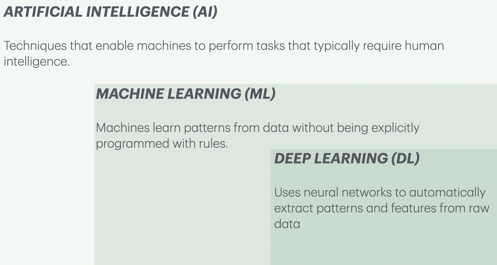
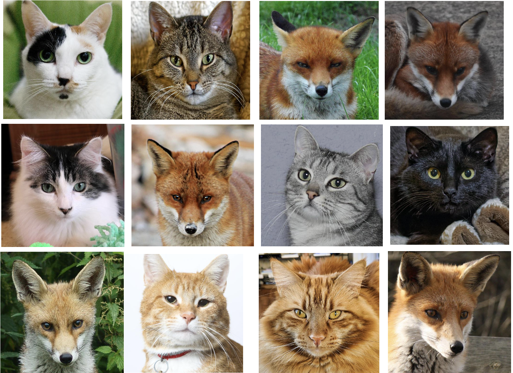

```{python}
import os
import sys

import matplotlib.pyplot as plt
import numpy as np
import pandas as pd

sys.path.append(os.path.join(os.path.abspath("."), "code"))
from plotting_functions import *
from sklearn.compose import ColumnTransformer, make_column_transformer
from sklearn.impute import SimpleImputer
from sklearn.model_selection import cross_val_score, cross_validate, train_test_split
from sklearn.neighbors import KNeighborsClassifier
from sklearn.pipeline import Pipeline, make_pipeline
from sklearn.preprocessing import OneHotEncoder, OrdinalEncoder, StandardScaler
from sklearn.svm import SVC
from sklearn.datasets import make_blobs, make_classification
DATA_DIR = os.path.join(os.path.abspath("."), "data/")

```

## Original vs AI? {.smaller}

Which cats do you think are AI-generated? 


## Original vs AI? {.smaller}

How did you decide?


## Which of these do you think use AI?

- Google's spam detector 📧
- Autocomplete on your phone 📱
- Face recognition 🔓
- Voice assistants 🎤
- Calculator ➕
- Netflix recommendations 🍿
- Alarm Clock ⏰

## Which of these do you think use AI?

- ✅ Google's spam detector 📧
- ✅ Autocomplete on your phone 📱
- ✅ Face recognition 🔓
- ✅ Voice assistants 🎤
- ❌ Calculator ➕
- ✅ Netflix recommendations 🍿
- ❌ Alarm Clock ⏰

What makes these different?

## 

**AI systems make predictions or decisions when there isn't a simple set of rules.** For example:

- Spam detector $\rightarrow$ Is this spam?
- Autocomplete $\rightarrow$ What word comes next?
- Face recognition $\rightarrow$ Is this the right person?
- Netflix $\rightarrow$ What movie might you like?

Whereas:

- Calculator $\rightarrow$ follows mathematical rules
- Stopwatch $\rightarrow$ counts time


## What are AI, ML, DL? {.smaller}
:::: {.columns}
::: {.column width="32%"}
**Artificial Intelligence (AI)**: Helps computers make predictions or decisions when there isn't a simple set of rules.
<br> 
**Examples:** [Deep Blue](https://www.ibm.com/history/deep-blue), early spell checkers
::: 
::: {.column width="32%"}
**Machine Learning (ML)**: Learning patterns from data instead of writing rules.<br>
**Example:** Spam filtering in Gmail 
:::
::: {.column width="36%"}
**Deep Learning (DL)**: Using neural networks to learn complex patterns from data.<br> 
**Examples:** ChatGPT, Face recognition in your phone
:::
::::

{.nostretch fig-align="center" width="700px"}

## Let's walk through an example 

- Have you used search in Google Photos? You can search for "cat" and it will retrieve photos from your libraries containing cats.
- This can be done using **image classification**. 

## Image classification {.smaller}
- Imagine we want a system that can tell cats and foxes apart.
- How might we do this with traditional programming? With ML?

:::: {.columns}

::: {.column width="35%"}
 
:::

::: {.column width="65%"}

| Image ID | Whiskers Present | Ear Size  | Face Shape | Fur Color  | Eye Shape   | Label |
|----------|------------------|-----------|------------|------------|-------------|-------|
| 1        | Yes              | Large     | Round      | Mixed      | Round       | Cat   |
| 2        | Yes              | Medium    | Round      | Brown      | Almond      | Cat   |
| 3        | Yes              | Large     | Pointed    | Red        | Narrow      | Fox   |
| 4        | Yes              | Large     | Pointed    | Red        | Narrow      | Fox   |
| 5        | Yes              | Small     | Round      | Mixed      | Round       | Cat   |
| 6        | Yes              | Large     | Pointed    | Red        | Narrow      | Fox   |
| 7        | Yes              | Small     | Round      | Grey       | Round       | Cat   |
| 8        | Yes              | Small     | Round      | Black      | Round       | Cat   |
| 9        | Yes              | Large     | Pointed    | Red        | Narrow      | Fox   |

::: 
::::

## Traditional programming: example

:::: {.columns}

::: {.column width="40%"}
 
:::

::: {.column width="60%"}
- You hard-code rules. If all of the following satisfy, it's a fox.     
    - pointed face ✅
    - red fur ✅
    - narrow eyes ✅    
- This works for normal cases, but what if there are exceptions
::: 

::::

## ML approach: example

:::: {.columns}

::: {.column width="50%"}
 
:::

::: {.column width="50%"}
- We don't tell the model the exact rule. Instead, we give it many labeled images, and it learns probabilistic patterns across multiple features, not rigid rules.
    - If fur is red $\rightarrow$ 90% chance of Fox.

::: 

::::

## DL approach: example 

:::: {.columns}

::: {.column width="40%"}
 
:::

::: {.column width="60%"}
- A neural network automatically learns which features to look at (edges $\rightarrow$ textures $\rightarrow$ objects).
- No need to even specify face shape or fur colour. It learns relevant features on its own. 
::: 

::::

## 

Would you solve this with AI?

| Problem | AI? |
|---------|:---:|
| 17 × 24 |  |
| Sort a list of numbers |  |
| Is this email spam? |  |
| Addressing mental health issues |  |
| Translate this sentence |  |
| Recommend a movie |  |
| Predict tomorrow's weather |  |

## [Therapists using ChatGPT secretly](https://www.technologyreview.com/2025/09/02/1122871/therapists-using-chatgpt-secretly/) 😔

{.nostretch fig-align="center"}

## When is AI a good choice?

AI isn't "better computing"; it's appropriate for a different class of problems. It works well when...

- ✅ There are lots of examples or data to learn from.
- ✅ The problem involves finding complex patterns or making predictions.
- ✅ There isn't a simple set of rules that always gives the right answer.


## When do we still need humans?

Humans are essential when a problem requires...

- 🧠 Common sense and deep understanding of the situation.
- ❤️ Empathy, ethics, or caring for people.
- ⚖️ Making important decisions where mistakes have serious consequences.
- ...

AI can sometimes assist people, but humans should make the important decisions when empathy, trust, and responsibility matter.


## What should you remember?

- AI is good at finding patterns.

- AI is useful when there isn't a perfect rule for solving a problem.

- AI can help people. But people are still responsible for important decisions.