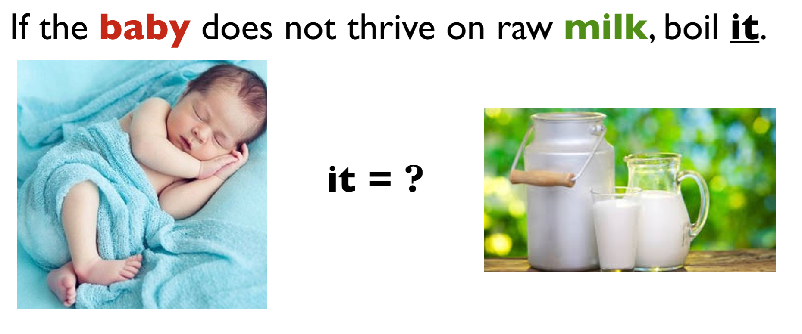
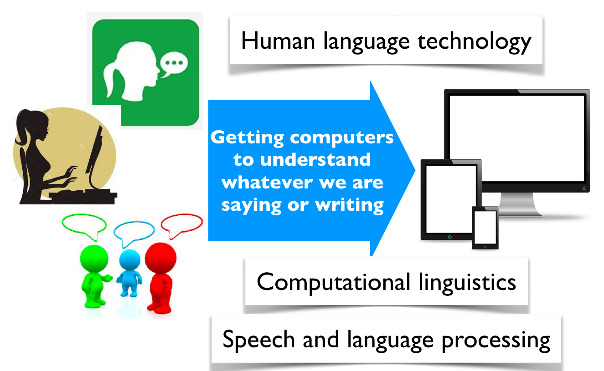
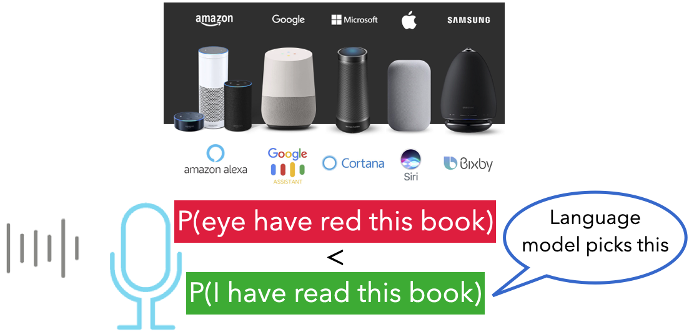

```{python}
import numpy as np
import pandas as pd
import matplotlib.pyplot as plt
import os
import sys
plt.rcParams["font.size"] = 16
DATA_DIR = 'data/' 
```

# How do computers understand language?

## Every day you interact with language AI

- 💬 ChatGPT answers questions
- 📱 Your phone finishes your sentences
- 📧 Gmail suggests replies
- 🌍 Google Translate translates languages
- 🔎 Google understands your searches

**How do computers do this? 🤔**

# Why is language difficult?

## Language can be ambiguous



## [Ambiguous news headlines](http://www.fun-with-words.com/ambiguous_headlines.html)

<blockquote>
PROSTITUTES APPEAL TO POPE
</blockquote>    

<blockquote>
KICKING BABY CONSIDERED TO BE HEALTHY    
</blockquote> 

<blockquote>
MILK DRINKERS ARE TURNING TO POWDER
</blockquote>

Why are these funny?

##

Humans solve these problems effortlessly because we use

- context
- common sense
- world knowledge

Computers don't naturally have these abilities.

## What is Natural Language Processing (NLP)?

Natural Language Processing (NLP) is the field of AI that focuses on enabling computers to understand, interpret, and generate human language.

{.nostretch fig-align="center" width="500px"}

## A surprising idea

Instead of teaching computers grammar ...

**What if we simply taught them to predict the next word?** Could that really work?

## Activity: Become a language model {.smaller background-color="#fafabc"}

Guess the next word.

| Prompt | Your prediction |
|---------|-----------------|
| Penut butter and ... | |
| Too much ... | |
| My dog at my ... | |
| Happy birthday ... | |
| The capital of Canada is ... | |

There isn't always one correct next word!! 

# What did you just do?

You acted like a **language model**! You

- used context
- considered several possibilities
- estimated which answer was most likely

A language model does exactly the same thing. It predicts the most likely continuation based on patterns it has learned from lots of text.

# A bit of history

:::: {.columns}

::: {.column width="35%"}


:::

::: {.column width="65%"}

In 1948, **Claude Shannon** asked exactly the same question:

> Can we predict the next word?

This simple idea became the foundation of modern language models.

(Anthropic's Claude is named after Claude Shannon.)

:::

::::

# What is a language model?

A **language model** predicts what word (or token) is most likely to come next.

Example

| Sentence | Most likely next word |
|-----------|----------------------|
| Peanut butter and | jelly |
| The capital of Canada is | Ottawa |
| Happy birthday | to |

## Context matters

Which word comes next?

> I went to the bank to deposit some ______

vs.

> I sat on the bank of the ______

- Same word. Different meanings.

- Language models use **context**.


## Language models assign probabilities

Instead of predicting one answer...

they estimate **many possibilities**.

> Peanut butter and 

| Next word | Probability |
|------------|------------:|
| jelly | 55% |
| banana | 25% |
| honey | 10% |
| cookies | 5% |
| ... | ... |

The highest probability usually becomes the prediction.

## Why does this work?

If a computer becomes really good at predicting the next word, it has learned

- grammar
- spelling
- common phrases
- facts
- some reasoning patterns

without being explicitly programmed.

## From prediction to applications

Good next-word prediction enables

- ✍️ Text generation
- 🌍 Translation
- 📝 Summarization
- 💬 Chatbots
- 🔎 Semantic search

Modern LLMs like ChatGPT build on this same idea.

## For example 

- P(I have read this book) > P(eye have red this book) or 
- P(book | read this) > P(book | red this)
  
{.nostretch fig-align="center" width="800px"}

## Activity: Build a Language Model {.smaller background-color="#fafabc"}

We need **10–15 volunteers**.

:::: {.columns}

::: {.column width="50%"}

### Group 1: Full-Context Storytellers

- Each volunteer receives the **entire sequence** generated so far.
- Predict the **next word**.
- Pass the updated sequence to the next person.
- The last volunteer reads the final sentence.

:::

::: {.column width="50%"}
### Group 2: One-Word Memory Storytellers

- Each volunteer receives **only the previous word**.
- Predict the **next word**.
- Pass only your predicted word to the next person.
- Collectively generated the final sentence.

:::

::::

## Reflection 

- Which story was easier to continue?
- Which story made more sense?
- What information did you use to predict the next word?
- What happened when you had very little context?

Key takeaway:

The more context we have, the better we can predict what comes next.

##

How much context and other knowlege do you need to predict the correct next word here? 

> _I am studying law at the University of British Columbia in Vancouver because I want to become a ..._

> _I am studying medicine at the University of British Columbia because I want to become a ..._

- More context $\rightarrow$ Better predictions.

- The simple model we used before remembers 1 previous word.

- Modern language models like GPT-5 can use up to about 300,000 previous words of context!

## Large Language Models 

This is why modern language models are so powerful.

Instead of looking at just one previous word, they can use information from hundreds of thousands of previous words to understand the conversation and generate much more coherent responses.